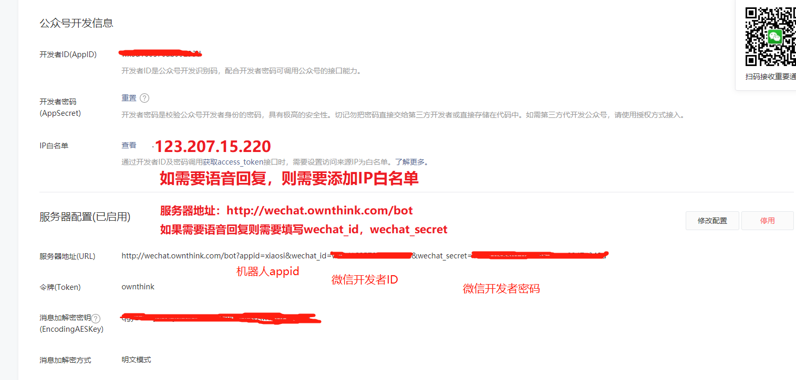

<h1 align = "center">微信机器人</h1>

# 项目地址

<p align="left"><font size="5">Appid获取地址：<a href="https://console.ownthink.com//"target="_blank">AI开放平台</a> 体验地址：<a href="https://www.ownthink.com/robot.html"target="_blank">小思</a> 项目地址：<a href="https://github.com/ownthink/robot/"target="_blank">GitHub</a></font></p>
---


# 微信机器人

微信机器人设置方式，将微信机器人请求地址`http://wechat.ownthink.com/bot`填入微信的服务器地址(URL)即可。

---

选填参数appid、wechat_id、wechat_secret。
```text
http://wechat.ownthink.com/bot?appid=【机器人appid】&wechat_id=【微信开发者ID】&wechat_secret=【微信开发者密码】
```

以上参数都填写后，将ip地址`123.207.15.220`加入微信白名单，可支持语音回复功能。


填写如下图：



